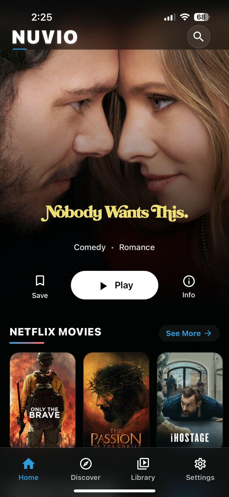
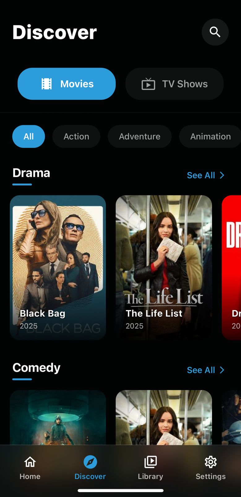
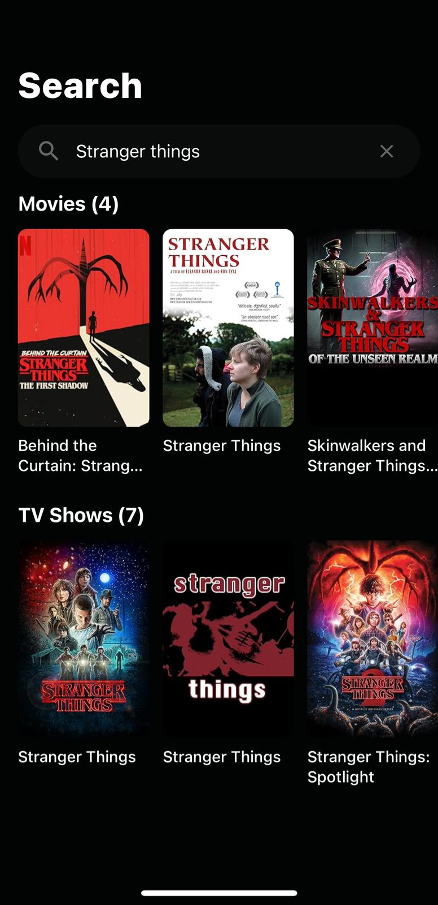
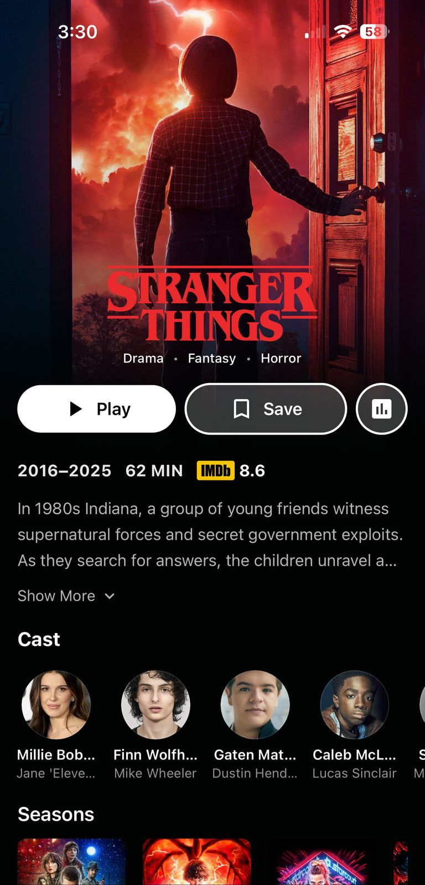
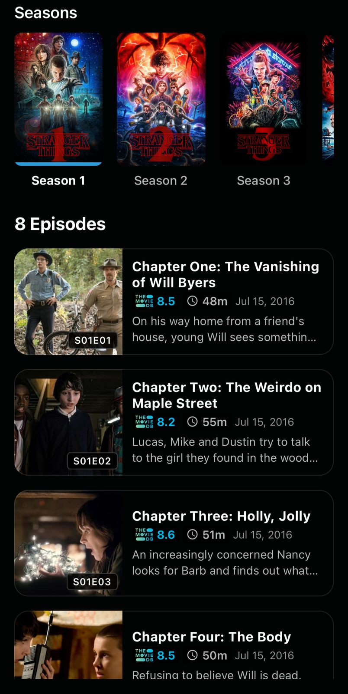
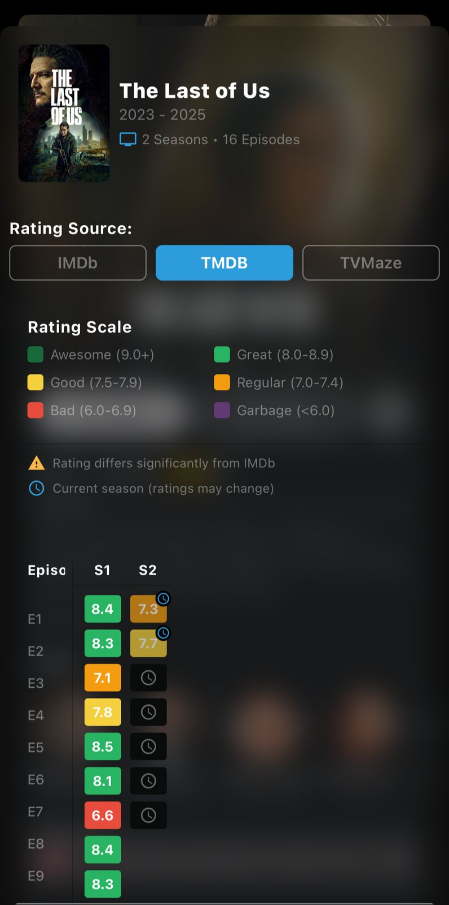

  

# Nuvio

An app I built with React Native/Expo for browsing and watching movies & shows. It uses Stremio-compatible addons to find streaming sources.

Built for iOS and Android.

## Key Features ✨

*   **Home Screen:** Highlights new content, your watch history, and content categories.
*   **Discover:** Browse trending and popular movies & TV shows.
*   **Details:** Displays detailed info (descriptions, cast, ratings).
*   **Video Player:** Integrated player(still broken on IOS,supports External PLayer for now).
*   **Stream Finding:** Finds available streams using Stremio addons.
*   **Search:** Quickly find specific movies or shows.
*   **Trakt Sync:** Planned integration (coming soon).
*   **Addon Management:** Add and manage your Stremio addons.
*   **UI:** Focuses on a clean, interactive user experience.

## 📸 Screenshots

| Home                                       | Discover                                   | Search                                   |
| :----------------------------------------- | :----------------------------------------- | :--------------------------------------- |
|                |        |          |
| **Metadata**                               | **Seasons & Episodes**                     | **Rating**                               |
|    | |    |

## Wanna run it? 🚀

1.  You'll need Node.js, npm/yarn, and the Expo Go app (or native build tools like Android Studio/Xcode).
2.  `git clone https://github.com/nayifleo1/NuvioExpo.git`
3.  `cd NuvioExpo`
4.  `npm install` or `yarn install`
5.  `npx expo start` (Easiest way: Scan QR code with Expo Go app)
    *   Or `npx expo run:android` / `npx expo run:ios` for native builds.

## Found a bug or have an idea? 🐛

Great! Please open an [Issue on GitHub](https://github.com/nayifleo1/NuvioExpo/issues). Describe the problem or your suggestion.

## Want to contribute? 🤝

Contributions are welcome! Fork the repository, make your changes, and submit a Pull Request.

---

Built with help from the communities and tools behind React Native, Expo, TMDB, Trakt, and the Stremio addon system.

*Happy Streaming!* 