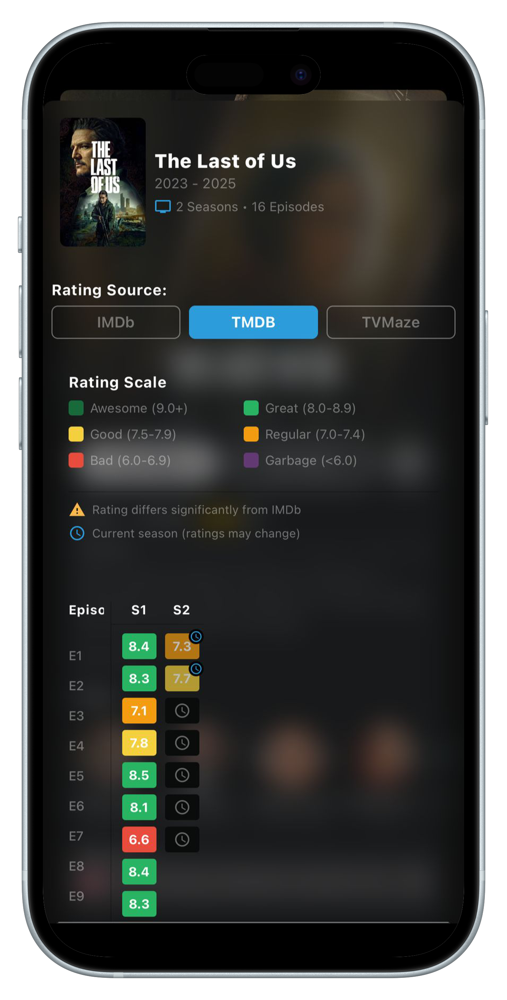
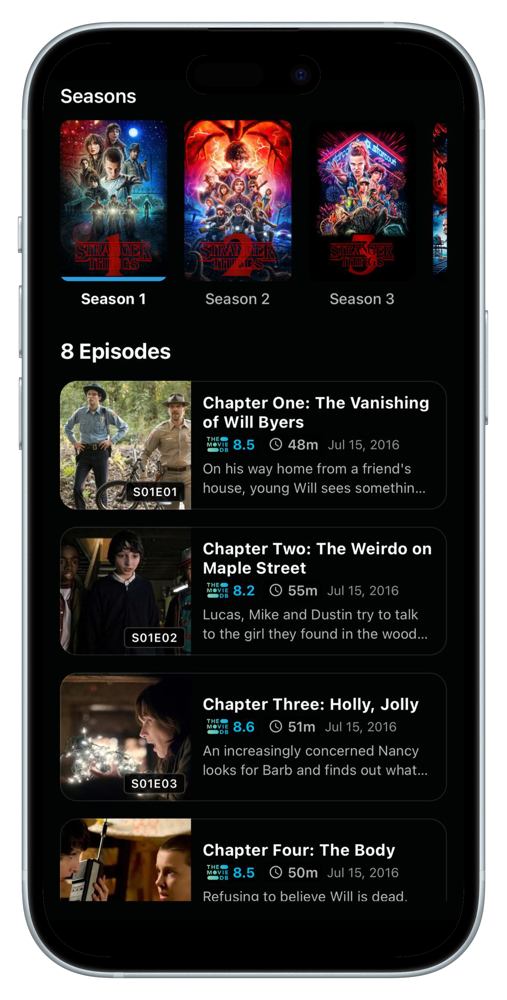

# Nuvio Streaming App

<p align="center">
  
</p>

<p align="center">
  A modern streaming application built with React Native and Expo, featuring comprehensive Stremio addon integration and Trakt.tv synchronization.
</p>

---

## ⚠️ Beta Release
This application is currently in beta. Please report any issues you encounter.

[Download Latest Release](https://github.com/tapframe/NuvioStreaming/tags)

---

## 📱 Installation

### AltStore Installation
 [](https://tinyurl.com/NuvioAltstore)

### SideStore Installation
 [](https://tinyurl.com/NuvioSidestore)

**Manual URL:** `https://raw.githubusercontent.com/tapframe/NuvioStreaming/main/nuvio-source.json`

---

## ✨ Core Features

### 🎬 Content Discovery
- **Personalized Recommendations:** Smart home screen with continue watching functionality
- **Advanced Search:** Comprehensive filtering and instant search results
- **Rich Metadata:** Detailed content information, cast, crew, and ratings
- **Calendar Integration:** Track upcoming episodes and releases
- **Library Management:** Personal collections with watch history tracking

### 🎥 Streaming Experience
- **Dual Player Support:** Built-in video player with gesture controls and external player integration
- **Intelligent Quality Selection:** Automatic stream optimization and subtitle support
- **Trailer Playback:** Seamless trailer integration with preloading
- **Continuous Playback:** Auto-play functionality for uninterrupted viewing
- **Progress Synchronization:** Resume playback across devices

### 🔗 Platform Integrations
- **Trakt.tv Sync:** Complete watch history, ratings, and library synchronization
- **Stremio Ecosystem:** Full addon compatibility with easy management
- **TMDB Integration:** Comprehensive metadata and high-quality imagery
- **MDBList Support:** Enhanced ratings and recommendations
- **Custom Scrapers:** Local content source integration

### 🎨 User Interface
- **Material Design:** Clean, modern interface with smooth animations
- **Dynamic Theming:** Content-based color extraction and customization
- **Cross-Platform:** Native experience on iOS and Android
- **Performance Optimized:** Efficient rendering and image caching

### 🔔 Advanced Features
- **Push Notifications:** New episode alerts and content reminders
- **Background Synchronization:** Automatic data updates and content sync

---

## 📸 Screenshots

| Home Screen | Details Page | Home Screen 2 |
|:-----------:|:------------:|:-------------:|
|  |  |  |

| Library | Player Loading | Video Player |
|:-------:|:--------------:|:------------:|
|  |  |  |

| Ratings | Episodes & Seasons | Search & Details |
|:-------:|:------------------:|:----------------:|
|  |  |  |

---

## 🧰 Tools & Technologies

<p align="left">
  <a href="https://skillicons.dev">
    
  </a>
</p>

---

## 🛠️ Development

### Prerequisites
- Node.js 18+
- npm or yarn
- Expo CLI

### Setup
```bash
git clone https://github.com/tapframe/NuvioStreaming.git
cd NuvioStreaming
npm install
npx expo start
```

### Build Commands
```bash
npx expo run:android  # Android build
npx expo run:ios      # iOS build
```

---

## 🤝 Contributing

1. Fork the repository
2. Create a feature branch
3. Make your changes
4. Submit a pull request

---

## 🐛 Issues

Report bugs and request features via [GitHub Issues](https://github.com/tapframe/NuvioStreaming/issues)

---


## 📄 License

[](http://www.gnu.org/licenses/gpl-3.0.en.html)

This project is licensed under the GNU General Public License v3.0 - see the [LICENSE](LICENSE) file for details.

---

## ⚖️ Disclaimer

This application functions as a content aggregator, accessing publicly available streams from third-party sources. No media content is hosted by this application. Users are responsible for compliance with applicable laws and regulations.

---

## 🙏 Acknowledgments

Built with support from:
- React Native & Expo
- TMDB API
- Trakt.tv
- Stremio